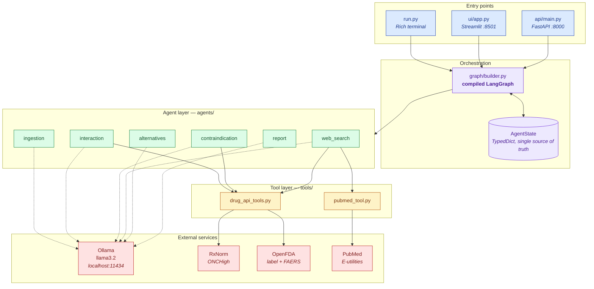
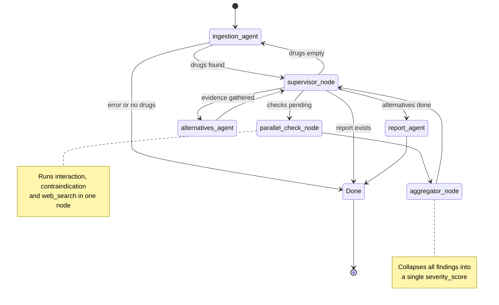
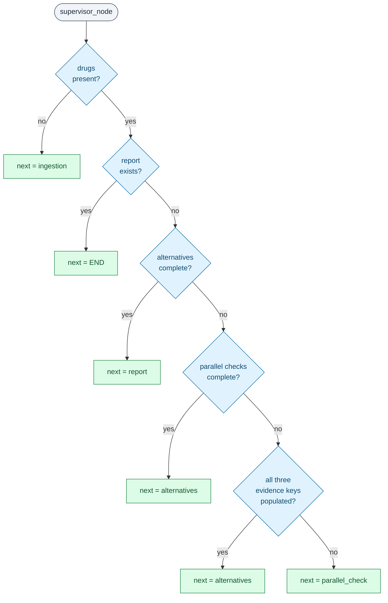
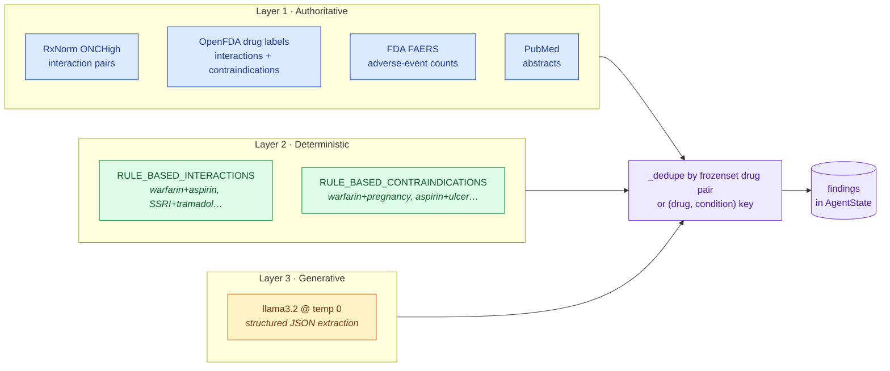
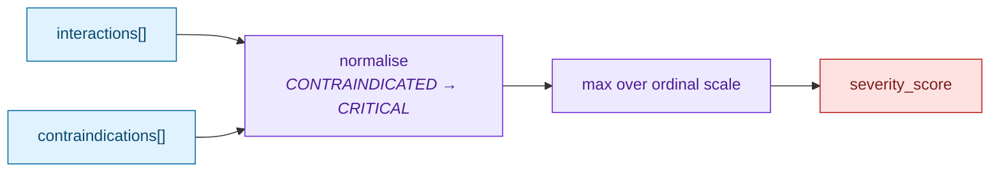
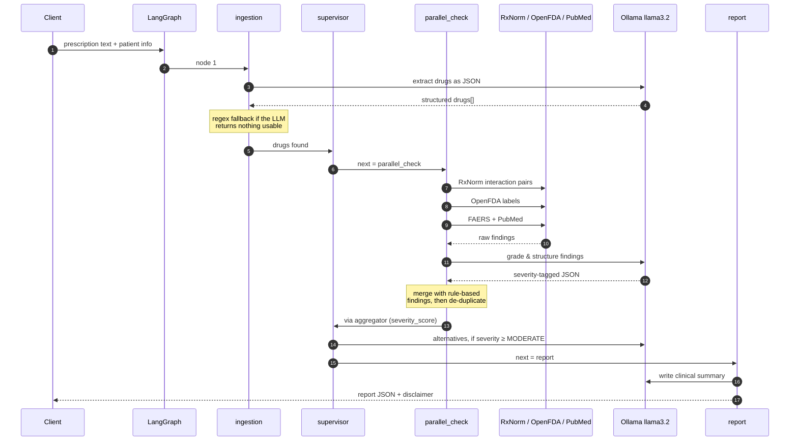
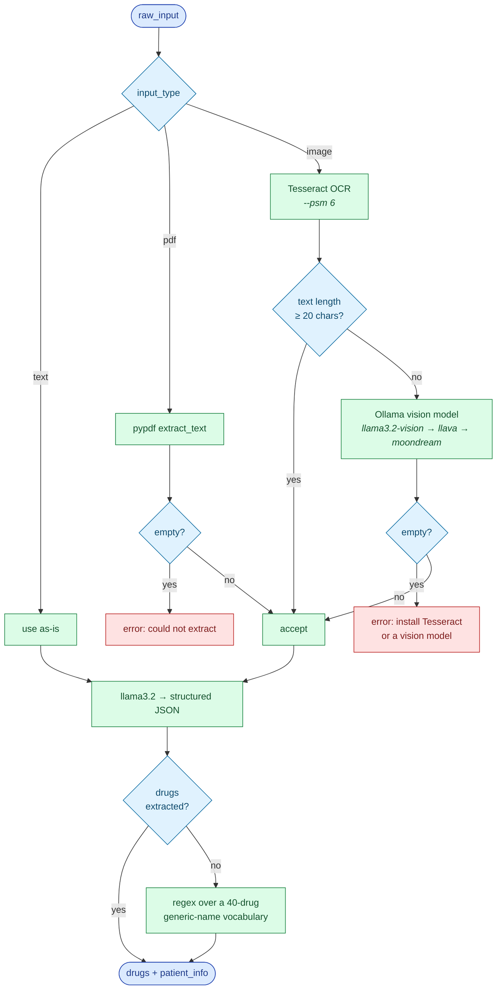

# RxCheck — Multi-Agent Drug Interaction Checker

A local-first clinical safety system that takes a free-text, PDF, or photographed prescription and returns a structured interaction report — severity-graded, source-attributed, and backed by three independent evidence layers so that a single failure (no internet, no LLM, an unreadable scan) degrades the answer instead of destroying it.

**Stack:** LangGraph · LangChain · Ollama (Llama 3.2) · RxNorm · OpenFDA · PubMed · FastAPI · Streamlit · Rich

> **Not a medical device.** Every report ends with a disclaimer for a reason. This is a decision-support prototype, not a substitute for a pharmacist.

---

## Table of contents

- [What it does](#what-it-does)
- [System architecture](#system-architecture)
- [The agent graph](#the-agent-graph)
- [How the supervisor routes](#how-the-supervisor-routes)
- [Evidence layering: why every agent has three sources](#evidence-layering-why-every-agent-has-three-sources)
- [Severity aggregation](#severity-aggregation)
- [Request lifecycle](#request-lifecycle)
- [Ingestion: the four-way fallback](#ingestion-the-four-way-fallback)
- [Design decisions](#design-decisions)
- [Installation](#installation)
- [Usage](#usage)
- [API reference](#api-reference)
- [Project layout](#project-layout)
- [Testing](#testing)
- [Known limitations](#known-limitations)

---

## What it does

```
"Warfarin 5mg OD, Aspirin 81mg OD"  +  optional age / conditions / allergies
        ↓
  parse drugs → gather evidence (RxNorm · OpenFDA · FAERS · PubMed · rules · LLM)
        ↓
  grade severity → suggest alternatives if ≥ MODERATE → write clinical summary
        ↓
  report: severity · urgency · interactions · contraindications · alternatives · sources
```

Input can be typed text, a prescription PDF, or a photo of a label. Output is a JSON report — rendered in the terminal, in the Streamlit app (with a JSON download), or returned by the API.

---

## System architecture

Three entry points share one compiled graph. Nothing leaves your machine except read-only lookups to public medical APIs; the LLM runs locally through Ollama.



Solid arrows are hard dependencies; dotted arrows are the local LLM, which **every** agent can lose without the pipeline failing.

---

## The agent graph

This is the actual compiled graph from [`graph/builder.py`](graph/builder.py) — six nodes, two conditional edges, one cycle back through the supervisor.



The supervisor is the only node that decides where to go next. Every worker node returns to it, so control flow lives in exactly one file instead of being smeared across the agents.

---

## How the supervisor routes

[`graph/supervisor.py`](graph/supervisor.py) is a pure function over state — no LLM call, no side effects, fully unit-testable. It reads accumulated evidence and writes a single `next` key.



Note the double guard at `Q4`/`Q5`: `parallel_checks_complete` is the authoritative flag, but the evidence-key check catches a resumed or externally-seeded state where the flag was never set. Two independent conditions guarantee the graph cannot loop forever on a half-populated state.

---

## Evidence layering: why every agent has three sources

The core design commitment. Each analytical agent queries **structured APIs**, applies **hard-coded clinical rules**, and asks the **LLM** — then merges and de-duplicates. No single layer is trusted alone.



**Why the rule layer exists at all.** RxNorm's `ONCHigh` source covers oncology-focused high-severity pairs and misses several textbook interactions — warfarin + aspirin among them. A demo that returns "no interactions detected" for the single most famous bleeding-risk pair is worse than useless, so the highest-consequence pairs are pinned in code and can never be lost to an API outage, a rate limit, or a hallucination.

Degradation is graceful in a specific order:

| Failure | Behaviour |
|---|---|
| Ollama not running | APIs + rules still produce findings; only the narrative summary is templated |
| No internet | Rules + LLM knowledge still produce findings |
| Both down | Rules alone still catch the pinned high-severity pairs |
| Everything down | Report is emitted with an explicit fallback summary, never a crash |

---

## Severity aggregation

`aggregator_node` collapses every interaction and contraindication into one ordinal score. It is a max, not an average — one CRITICAL finding must not be diluted by nine SAFE ones.



| Score | Ordinal | Meaning | Downstream effect |
|---|---|---|---|
| `SAFE` | 0 | No findings | Alternatives agent **skipped** |
| `LOW` | 1 | Minor, rarely significant | Alternatives agent **skipped** |
| `MODERATE` | 2 | Dose adjustment or monitoring | Alternatives generated |
| `HIGH` | 3 | Significant risk, intervention needed | Alternatives generated |
| `CRITICAL` | 4 | Should not be co-prescribed | Alternatives generated |

The `SAFE`/`LOW` short-circuit in [`agents/alternatives_agent.py`](agents/alternatives_agent.py) is a cost decision: suggesting substitutes for a benign combination burns an LLM call and invites the model to invent a problem that isn't there. The one exception — any contraindication present forces alternatives regardless of interaction severity.

---

## Request lifecycle

End-to-end for `POST /check/text`, showing where the network is actually touched.



A typical text run makes **4–6 LLM calls** and **3–10 HTTP requests**, most of the wall-clock time being local inference.

---

## Ingestion: the four-way fallback

The most defensive part of the system, because input quality is the least controllable variable.



Three cascading fallbacks — OCR → vision model → regex — because a prescription photo is the input most likely to be bad, and returning "I couldn't read that" on a legible image is the failure users forgive least.

---

## Design decisions

<details>
<summary><b>1. Supervisor pattern over a linear chain</b></summary>

<br/>

A fixed chain (`ingest → check → report`) would have been shorter. The supervisor exists so the graph can *re-enter* nodes: if ingestion yields nothing, the supervisor routes back to ingestion rather than dead-ending. It also means adding an agent requires editing one routing function, not rewiring the chain.

**Cost:** every worker node makes a round trip through the supervisor, which shows up as extra graph steps in traces.
</details>

<details>
<summary><b>2. `parallel_check_node` is sequential, deliberately</b></summary>

<br/>

The node is named for its *logical* fan-out — three independent evidence gatherers — but [`graph/builder.py`](graph/builder.py) calls them one after another in a single node:

```python
def parallel_check_node(state):
    state = interaction_node(state)
    state = contraindication_node(state)
    state = web_search_node(state)
    return {**state, "parallel_checks_complete": True}
```

True LangGraph branch-parallelism would need a reducer on every `AgentState` key to merge three concurrent partial states. Sequential composition keeps state updates totally ordered and the merge trivial. The real bottleneck is Ollama, which serialises requests anyway — parallelising the HTTP calls would save little.

**Trade-off:** wall-clock latency is the sum, not the max, of the three agents. Worth revisiting if the LLM moves to a batching backend.
</details>

<details>
<summary><b>3. A local LLM, not a hosted API</b></summary>

<br/>

Prescriptions are PHI. Ollama means the raw text never leaves the machine, there's no per-token cost during development, and the project runs offline. Drug *names* are still sent to public APIs — a materially smaller disclosure than a full prescription, and those endpoints are read-only and unauthenticated.

**Trade-off:** Llama 3.2 3B follows JSON instructions imperfectly. Hence `temperature=0`, an explicit schema in every system prompt, `re.search(r'\{.*\}', ..., re.DOTALL)` to salvage JSON from prose, and a non-LLM fallback on every path.
</details>

<details>
<summary><b>4. `TypedDict` state with dict-merge updates</b></summary>

<br/>

Every node returns `{**state, "key": value}` rather than mutating. Nodes stay pure and independently testable, and any node can be re-run without corrupting what came before. `AgentState` is a `TypedDict` for LangGraph compatibility, while the Pydantic models in [`graph/state.py`](graph/state.py) document the intended shape of each list element.

**Trade-off:** those Pydantic models aren't enforced at runtime on the state dicts — they're documentation with teeth only where explicitly constructed.
</details>

<details>
<summary><b>5. De-duplication keyed on unordered pairs</b></summary>

<br/>

Three evidence sources will report the same interaction differently — "warfarin/aspirin" from rules, "Aspirin/Warfarin" from RxNorm, "aspirin + warfarin" from the LLM. Keys are normalised to `tuple(sorted([d1, d2]))` after lower-casing and stripping, so direction never creates a duplicate. Contraindications use `(drug, condition)`.

First writer wins. The interaction agent merges `llm + rule_based`, putting the LLM's richer prose first; the contraindication agent merges `llm + fda + rule_based`, preferring label text over generic rules.

**Trade-off:** because the LLM's entry wins the tie, it also wins on *severity*. If llama3.2 grades warfarin + aspirin as `MODERATE`, the pinned `HIGH` rule for the same pair is discarded before the aggregator ever sees it — the layer meant to be a floor can be silently downgraded. Keeping the maximum severity across duplicates, while still taking the LLM's description, would close that gap.
</details>

<details>
<summary><b>6. Rate limiting by sleeping</b></summary>

<br/>

`check_all_interactions` sleeps 200 ms between RxNorm calls, and the web-search agent caps itself at the first 3 drugs for FAERS lookups. Crude, but these are unauthenticated public endpoints with no documented quota — being a slow client is cheaper than being a blocked one.

**Trade-off:** an 8-drug prescription spends ~1.6 s sleeping. A proper token bucket with per-host budgets would be the real fix.
</details>

<details>
<summary><b>7. Every external call swallows its exception</b></summary>

<br/>

Every function in [`tools/drug_api_tools.py`](tools/drug_api_tools.py) is wrapped in `try/except Exception: pass` and returns an empty list on failure. In a clinical tool, a partial report clearly labelled with its sources beats a stack trace — a pharmacist can act on three of four evidence layers.

**Trade-off:** genuine bugs hide as silent empty results. Structured logging that distinguishes "API returned nothing" from "API call raised" is the obvious next step.
</details>

<details>
<summary><b>8. Severity is a max, and CONTRAINDICATED collapses into CRITICAL</b></summary>

<br/>

Averaging would let a long benign medication list mask one dangerous pair. RxNorm and the LLM both emit `CONTRAINDICATED`; the aggregator maps it onto `CRITICAL` so the ladder stays a single 0–4 scale that the UI, the CLI colour map, and the alternatives gate can all share.
</details>

---

## Installation

```bash
git clone <your-repo-url>
cd "drug checker"
python -m venv venv
```

Activate it:

```bash
source venv/bin/activate      # macOS / Linux
venv\Scripts\activate         # Windows
```

Install and pull the model:

```bash
pip install -r requirements.txt
ollama pull llama3.2
```

**Optional, for image input:**

- [Tesseract OCR](https://github.com/tesseract-ocr/tesseract) on your `PATH` — the fast path
- `ollama pull llama3.2-vision` (or `llava`) — the fallback for photos Tesseract can't read

Everything else — RxNorm, OpenFDA, PubMed — is unauthenticated. No API keys, no `.env`.

---

## Usage

**CLI**

```bash
python run.py "Warfarin 5mg OD, Aspirin 81mg OD"
```

```bash
python run.py "Metformin 1000mg BD" --age 72 --conditions "renal impairment" --allergies penicillin
```

```bash
python run.py --file prescription.pdf --json
```

**Streamlit UI**

```bash
streamlit run ui/app.py
```

A two-screen flow: a landing screen with Text / PDF / Image tabs and optional patient details, then a results screen with severity and urgency badges, per-finding cards, and a JSON report download. The compiled graph is cached in `st.session_state`, so it's built once per session rather than per check.

**REST API**

```bash
python api/main.py
```

Then `http://localhost:8000/docs` for interactive OpenAPI docs.

### Sample prescriptions

| Scenario | Prescription | What it exercises |
|---|---|---|
| Bleeding risk | `Warfarin 5mg OD, Aspirin 81mg OD` | Pinned rule pair + warfarin/aspirin contraindication rules |
| Serotonin risk | `Sertraline 50mg OD, Tramadol 50mg TID` | Pinned SSRI + tramadol rule |
| Renal concern | `Metformin 1000mg BD, Contrast media` | Non-drug input — relies on LLM parsing, not the regex fallback |
| Benign combo | `Amlodipine 5mg OD, Atorvastatin 40mg OD` | The `SAFE`/`LOW` short-circuit that skips the alternatives agent |
| Polypharmacy | `Warfarin 5mg, Aspirin 81mg, Ibuprofen 400mg TID, Fluoxetine 20mg OD` | Pairwise fan-out, de-duplication, max-severity aggregation |

Findings graded by the LLM vary between runs and model versions; only the rule-based findings are deterministic.

---

## API reference

| Method | Endpoint | Body | Returns |
|---|---|---|---|
| `GET` | `/` | — | Service banner |
| `GET` | `/health` | — | `{"status": "healthy"}` |
| `POST` | `/check/text` | `prescription_text`, optional `patient_age`, `patient_conditions[]`, `patient_allergies[]` | Report JSON |
| `POST` | `/check/pdf` | multipart `file` (`.pdf`) | Report JSON |
| `POST` | `/check/image` | multipart `file` (`.png .jpg .jpeg .tiff .bmp`) | Report JSON |

<details>
<summary><b>Report schema</b></summary>

<br/>

```json
{
  "report_id": "DIC-20260330103517",
  "generated_at": "2026-03-30T10:35:17.000000",
  "overall_severity": "HIGH",
  "urgency": "URGENT",
  "follow_up_required": true,
  "drugs_analyzed": ["warfarin", "aspirin"],
  "patient_info": { "age": 72, "conditions": [], "allergies": [] },
  "clinical_summary": "…",
  "key_recommendations": ["…"],
  "interactions": [
    {
      "drug1": "warfarin",
      "drug2": "aspirin",
      "severity": "HIGH",
      "description": "…",
      "recommendation": "…",
      "source": "RuleBasedKnowledge"
    }
  ],
  "contraindications": [],
  "alternatives": [],
  "web_findings": [],
  "disclaimer": "…"
}
```

Every finding carries a `source`, so a reader can always tell whether a claim came from an FDA label, a pinned rule, or the model.
</details>

---

## Project layout

```
drug checker/
├── graph/                    Orchestration — no clinical logic lives here
│   ├── state.py              AgentState TypedDict + Pydantic shapes
│   ├── builder.py            Node registration, edges, parallel & aggregator nodes
│   ├── supervisor.py         Pure routing function
│   └── edges.py              Conditional-edge predicates
├── agents/                   One file per agent, each a State → State function
│   ├── ingestion_agent.py    Text/PDF/OCR/vision → structured drugs
│   ├── interaction_agent.py  RxNorm + OpenFDA + rules + LLM
│   ├── contraindication_agent.py
│   ├── web_search_agent.py   PubMed + FAERS synthesis
│   ├── alternatives_agent.py Gated on severity ≥ MODERATE
│   └── report_agent.py       Final clinical narrative
├── tools/                    Pure I/O, no state awareness
│   ├── drug_api_tools.py     RxNorm, OpenFDA labels, FAERS, DailyMed
│   └── pubmed_tool.py        E-utilities esearch + efetch
├── api/main.py               FastAPI, three endpoints
├── ui/app.py                 Streamlit front end
├── run.py                    Rich CLI
└── tests/test_suite.py       Unit + integration, Ollama mocked out
```

The layering rule: `tools/` knows nothing about `AgentState`, `agents/` knows nothing about the graph topology, and `graph/` knows nothing about medicine.

---

## Testing

```bash
python tests/test_suite.py
```

The suite mocks `requests.get` and the Ollama client, so it runs with no network and no model pulled — CI-friendly by construction. Coverage focuses on the deterministic surface: severity mapping, RxCUI parsing, de-duplication keys, and supervisor routing.

---

## Known limitations

- **`parallel_check_node` is sequential.** See [design decision 2](#design-decisions). Latency is the sum of three agents.
- **The regex fallback recognises ~40 generic names.** Brand names, combination products, and anything outside that vocabulary are missed when the LLM is unavailable. One entry (`furosemise`) is a typo for `furosemide` and will never match.
- **RxNorm is queried with `sources=ONCHigh` only.** Broad coverage of non-oncology interactions depends on the rule layer and the LLM.
- **The LLM can downgrade a pinned rule.** De-duplication keeps the first entry per drug pair and the LLM's findings come first, so a `MODERATE` LLM grading replaces a `HIGH` rule for the same pair. See [design decision 5](#design-decisions).
- **Rule-based knowledge covers 4 interaction pairs and 2 drugs' contraindications.** Enough to demonstrate the layering; nowhere near a clinical knowledge base.
- **No persistence.** Every request re-queries every API. `chromadb` is in `requirements.txt` but unused — the intended home for a report cache and a retrieval layer over label text.
- **No authentication or rate limiting on the API.** CORS is `allow_origins=["*"]`. Fine for localhost, unshippable beyond it.
- **PubMed abstracts are truncated to the first `AbstractText` element**, so structured abstracts lose their Methods and Results sections.

---

## License

Educational and research use. Not validated for clinical decision-making.
